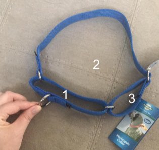

Tako用户手册

## 饮食

Tako目前的饮食习惯是一日两餐，早晚各一次。

为了防止狗狗半夜排尿，可以在晚上7点过后（或者晚上排尿后）对其断水。

## 运动

一定程度的运动可以防止Tako在家无聊或者打扰其他人。推荐的运动量是**散步25分钟以上**或者**狗公园15分钟**以上。

### 狗公园

狗公园是Tako的游乐场所，<strike>Tako去狗公园比见到亲爹还高兴</strike>。下面是一些可能需要的注意事项：

* Tako还是一只puppy，因此他的精力会十分旺盛
* 如果Tako和其他狗狗厮打起来，<strike>那一般都是Tako主动招惹人家</strike>。如果遇到以下情况，可能需要干预：
  * 两方有一方开始狂叫
  * Tako开始[hump](https://tenor.com/bltja.gif)另一只狗
  * 另一只狗的主人开始翻白眼🙄

## 装备

项圈：将leash套在❶上的金属圆环，把❷套在Tako的脑袋上

!!! warning

    套好项圈后请检查拉扯leash时，项圈的周长应该会缩小。如果不会缩小，应该是套错区域了。

